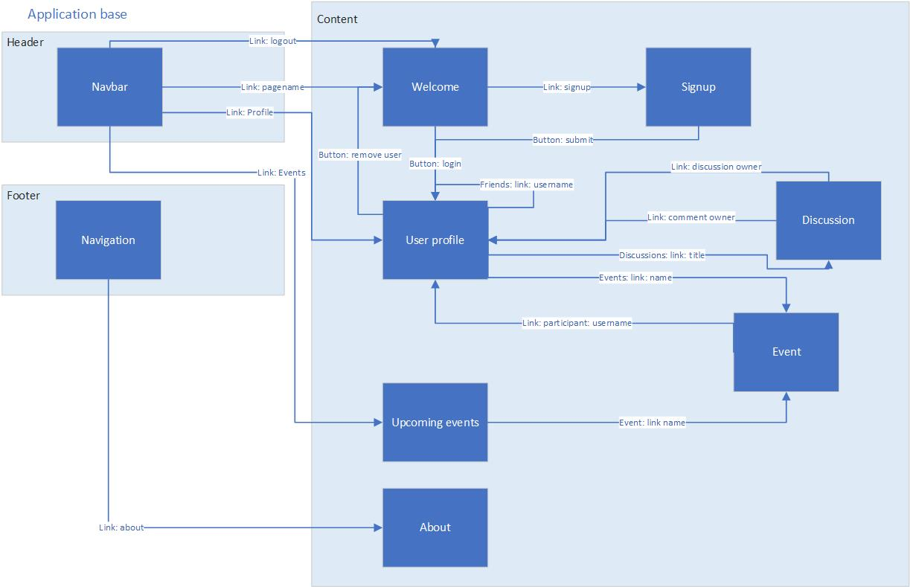

**Welcome to the home of your group's BWA course project code and documentation!**

This file is where your group writes your project plan/project report.

When you write it, you must use Markdown. [Documentation for GitLab Flavored Markdown (GFM)](https://docs.gitlab.com/ee/user/markdown.html).

# Initial project plan document
The headers that must be present in this document are shown here. They were copied here from the course project assignment document.

For instructions on what to add under these headers, see the course project assignment document, [Appendix 2: Initial project plan document](https://docs.google.com/document/d/1iJ4z8dQzUWht0ABX18RXa5Rp8hY76vcMJvBbxODs3PE/edit?usp=sharing#heading=h.m6xhgmo8x8lz)

## Course project group information
Group-Name: bwa-group038

* Giovanni Cioffi - 282979 - giovanni.cioffi@studenti.tut.fi
* Robert Fuhrmann - 282790 - robert.fuhrmann@student.tut.fi

GitLab-URL: https://course-gitlab.tut.fi/bwa-2018/bwa-group038  
Heroku-URL (HTTPS!): https://bwa-group038.herokuapp.com/

## Must have features
1. [x] django models
2. [x] users and admins from django user model
3. [x] admin have full CRUD permission
4. [x] signup, login, logout, delete account
5. [x] user can edit and delete personal information (real name, username (no change), a valid email (no change), phone number, address)
6. [x] user_profile page with public and private (just shown to friends) data
7. [x] user_profile has changeble status and list of old status (chronological) and comments
8. [x] user_profile contains sections for friendships, friend-requests, discussions, events, groups
9. [x] username is public and not changable
10. [x] user has status
11. [x] other users can comment on status
12. [x] users can form friendships
13. [x] user a send friend-request to user b with username
14. [x] user b see friend-request in user-list
15. [x] friend-request contains real name, username, date and time 
16. [x] user b can accept (add to friend-list) or decline (show info to user a) friend-request
17. [x] friendships can be deleted (from both users lists)
18. [x] discussions must use ajax
19. [x] users can send messages in discussion 
20. [x] discussions have a 5sec. fetch interval
21. [x] discussion messages of all users have chronological order
22. [x] discussion comment contains, username, date, time, message
23. [x] discussion comments can be deleted by discussion- or comment-owner
24. [x] each discussion has unique url

Decide initially which tasks (design, research, implement, test,...) are needed to complete each feature. Add them to GitLab’s Issue Board in your repo.

## Planned +2 features
### 1-star features
1. [x] Exceptional quality of the initial project plan document
2. [x] Mid-project check-in shows faster than expected progress
3. [ ] Make users, events and discussions searchable
4. [ ] Email validation on sign-up (OPTIONAL)
5. [ ] Reset forgotten password (OPTIONAL)
6. [x] Use separate Django apps for different parts of your project
7. [x] Status messages on the users’ profile pages

### 2-star features
8. [x] Using Bootstrap for mobile friendliness
9. [x] Use PostgreSQL as database
10. [x] Events
11. [ ] Groups (OPTIONAL)

### 3-star features
12. [ ] REST API for the site’s resources
13. [ ] Thorough testing using Django test (OPTIONAL)

## Pages and navigation
### Navigation
* navbar
    * page name / symbol => welcome
    * profile (if logged in) => user_profile
    * events (if logged in) => upcoming_events
    * logout (if logged in) => welcome
* footer
    * about
* welcome page: is shown first
    * Button: submit (login) => user_profile
    * Link: signup => signup
* signup
    * Button: signup => user_profile  
* user_profile
    * Link: friend-username => user_profile
    * Link: discussion-title => discussion
    * Link: event-name => event
* discussion
    * Link: discussion-owner => user_profile
    * Link: comment-owner => user_profile
* event
    * Link: participant-username => user_profile
* upcoming_events
    * Link event-name => event

### Pages
* welcome
    * startpage
    * user login
    * link so signup
* user_profile
    * private parts, allow editing profile
    * public parts, view
    * name, img
    * section: contact
    * section: change password
    * section: friendships
    * section: discussions
    * section: events
    * section: address
    * section: privacy
    * section: remove user profile
* event
	* for a single event
	* event details
	* list of participants
* upcoming_events
	* with a list of all events which end_date + end_time in future
* not_invited_to_event_warning
	* when user click on event in coming_events-page but is not invited
	* link to welcome page
* discussion
	* for a single discussion
* about

## Technological considerations
General
1. all data is processed in python (not js)
2. bootstrap collapse (instead of multiple pages) used for visual managing data in templates 
3. input is validated before sending to the database
4. wrong inputs (e.g. pw) don´t lead to 404, but to bootstrap-alerts
5. users can define security settings for friends (not for visitors)
6. visitors can see less or equal data than friends
7. input elements are provided by forms
8. forms are loaded by add_functions in corresponding app
9. forms are presented by corresponding form.html
10. if model fields have no default, null is set to true to avoid PostgreSQL errors, validation in code necessary
11. data is preferably marked as removed than actually be removed, to allow future analysis

User status
* Comments can only added by friends
* only the current status can be commented
* old status can only be shown (not edited)
* created status cannot be edited, but replaced by new status instead

Friends
* are managed in user_profile friends_section
* friendships can be added by invitations
* invitations can be accepted or declined
* if accepted, the friendship requests is removed and a friendship is added
* if declined, the friendship request is removed from recipient, for the sender the status "declined" is shown, the sender can remove the declined request
* requests can be created multiple times, as long as no open, or accepted request exists 

Discussions
* are created and listed in user_profile discussions_section
* can be shown and edited in discussion page
* can be visited by everyone
* can be commented by every logged in user
* users can subscribe to discussions
* users see all self created and subscribed discussions in user_profile discussions_section
* users can unsubscribe from a discussion, to remove it from own discussions_section
* discussions can be closed (no more comments possible) or deleted (removed from discussions_section) by owner

Events
* are created and listed in user_profile events_section
* can be shown and edited in event page
* can be visited by invited participants
* users can become a participant on a invitation-accept/decline basis (equal to friendships)
* the event_owner is always a participant
* all participants can invite only friends to the event

Upcoming events
* only events with end_datetime >= current_datetime are shown

### Django apps in your Django project
Every app contains all necessary models, templates and view-functionality for own purposes. Models from other apps will be imported.

* base
    * contains layout -template
    * contains header -template
    * contains footer -template
* about
    * contains about -template
* welcome
    * contains welcome -template
    * contains registration -template
* users
    * contains address_form -template
    * contains address_section -template
    * contains contact_form -template
    * contains contact_section -template
    * contains friend_form -template
    * contains friend_section -template
    * contains image_form -template
    * contains password_form -template
    * contains privacy_form -template
    * contains privacy_section -template
    * contains status_comment_form -template
    * contains status_comment_section -template
    * contains status_form -template
    * contains status_section -template
    * contains user_form -template
    * contains user_profile -template
    * contains user_section -template
* events
    * contains event -template
    * contains event_form -template
    * contains participant_form -template
    * contains participant_section -template
    * contains upcoming_events -template
    * contains warning_no_permission -template
 * discussions
     * contains discussion -template
     * contains discussion_comment_form -template
     * contains discussion_comment_section -template
     * contains discussion_form -template
     * contains discussion_section -template

### Needed Django models and their attributes
* User  
(stores user data)
	* first_name (django model)
	* last_name (django model)
	* username (django model)
	* email (django model)
	* phone (CharField, max_length=50)
	* address (CharField, max_length=255)(One-to-many:foreign_key => Address)
	* permissions (django model)
	* logged_in (BooleanField)
	* img (ImageField)
	* date_joined (django model)
	* friends (many-to-many:foreign_key => User)
	* is_active (BooleanField)
* friendship    
(stores friendships, friendship-requests and declined friendships)
    * request_date (DateField)(null=false)
    * response_date (DateField)
    * sender (many-to-one:foreign_key => User, null=false)
    * recipient (many-to-one:foreign_key => User, null=false)
    * status (CharField, max_length=20)(null=false) (request, accepted, declined, removed)
* Address   
(stores address data for users and events)
	* country (CharField, max_length=254)(null=false)
	* postal_code (PositiveSmallIntegerField)(null=false)
	* town (CharField, max_length=254)(null=false)
	* street (CharField, max_length=254)(null=false)
	* street_number (PositiveSmallIntegerField)(null=false)
* Status    
(stores status of users)
	* owner (many-to-one:foreign_key => User, null=false)
	* title (CharField, max_length=254)(null=false)
	* message (TextField)
	* datetime (DateTimeField)
* Status_Comment    
(stores comments on user status)
	* message (TextField)(null=false)
	* datetime (DateTimeField)(null=false)
	* user (many-to-one:foreign_key => User, null=false)
	* status (many-to-one:foreign_key => Status, null=false)
* Privacy
(stores privacy settings for user)
    * user = models.OneToOneField(User, on_delete=models.CASCADE, primary_key=True)
    * contact = models.BooleanField(default=False)
    * address = models.BooleanField(default=False)
    * status_comments = models.BooleanField(default=False)
    * friends = models.BooleanField(default=False)
    * discussions = models.BooleanField(default=False)
    * events = models.BooleanField(default=False)
    * groups = models.BooleanField(default=False)
* Discussion    
(stores discussions between users)
    * owner (many-to-one:foreign_key => User, null=false)
    * participants (many-to-many:foreign_key => User)
    * title (CharField, max_length=254)(null=false)
    * message (TextField)
    * status (CharField(max_length=50, null=False, default="open"), {open, closed, removed})
* Discussion_Comment    
(stores comments for discussions between users)
    * message = models.TextField(null=False, default="Message")
    * datetime = models.DateTimeField(auto_now=True)
    * user = models.ForeignKey(settings.AUTH_USER_MODEL, on_delete=models.CASCADE, related_name="discussion_comments", null=True)
    * discussion = models.ForeignKey(Discussion, on_delete=models.CASCADE, related_name="comments", null=True)
    * status = models.CharField(max_length=50, null=False, default="open") , {open, removed}
* Event     
(stores events)
	* owner (many-to-one:foreign_key => User, null=false)
	* participants (many-to-many:foreign_key => User)
	* name (CharField, max_length=254)(null=false)
	* description (TextField)
	* category (IntegerField, max_length=254) (numbers mapped to names)
	* start_datetime (DateTimeField)(null=false)
	* end_datetime (DateTimeField)(null=false)
	* place (many-to-one:foreign_key => Place, null=false)
	* status(CharField, {open, removed})
* Place     
(stores places for events)
	* name (CharField, max_length=254)(null=false)
	* description (CharField, max_length=254)
	* address (many-to-many:foreign_key => Address, null=true)
* EventInvitation
(stores invitations for events)
    * creation_datetime = models.DateTimeField(auto_now=True)
    * event = models.ForeignKey(Event, on_delete=models.CASCADE, related_name="invitations", null=True)
    * request_datetime = models.DateTimeField(auto_now=True)
    * response_datetime = models.DateTimeField(null=True)
    * sender = models.ForeignKey(settings.AUTH_USER_MODEL, on_delete=models.CASCADE, related_name="event_invitations_requested", null=True)
    * recipient = models.ForeignKey(settings.AUTH_USER_MODEL, on_delete=models.CASCADE, related_name="event_invitations_receipt", null=True)
    * status = models.CharField(max_length=20, null=False, default='request'), {request, accepted, declined, removed}
* Group (not implemented)
(stores groups for users)
	* owner (many-to-one:foreign_key => User, null=false)
	* participant (many-to-many:foreign_key => User)
	* name (CharField, max_length=254)(null=false)
	* description (CharField, max_length=254)
	* subject (CharField, max_length=254)

### URIs
* admin
    * administration panel: admin/
* base
    * logout: logout/
* welcome
	* show startpage: /
	* show registration: /registration/
* user_profile
	* show user_profile: /profile/\<str:username>/
	* remove_user:  /profile/\<str:username>/remove_user/
	* accept_friendship: /profile/\<str:username>/accept_friendship/\<int:pk>/
	* decline_friendship: /profile/\<str:username>/decline_friendship/\<int:pk>/
	* remove_friendship: /profile/\<str:username>/remove_friendship/\<int:pk>/
* event
	* show_event: /event/\<int:pk>/
	* remove_event: /event/\<int:pk>/remove_event/
	* accept_invitation: /event/\<int:pk>/accept_invitation/\<str:username>/
	* decline_invitation: /event/\<int:pk>/decline_invitation/\<str:username>/
	* remove_invitation: /event/\<int:pk>/remove_invitation/\<str:username>/
	* remove_participation: /event/\<int:pk>/remove_participant/\<str:username>/
	* remove_participant: /event/\<int:pk>/remove_participant/\<str:username>/
	* warning_no_permission: /event/no_permissions/\<str:uri>/
	* upcoming_events: /event/upcoming/
* discussion
	* show_discussion: /discussion/\<int:pk>/
	* get_discussion_comments: /discussion/\<int:pk>/get_discussion_comments/
	* close_discussion: /discussion/\<int:pk>/close_discussion/
	* remove_discussion: /discussion/\<int:pk>/remove_discussion/
	* remove_discussion_comment: discussion/\<int:discussion_pk>/remove_discussion_comment/\<int:comment_pk>/
	* add_participant: discussion/\<int:pk>/add_participant/\<str:username>/
	* remove_participant: discussion/\<int:pk>/remove_participant/\<str:username>/
* about
	* show_about: /about/

### Needed Django views and templates
## Views
* base
    * logout_view
* about
    * about
* welcome
    * welcome
    * signup
* users
    * user_profile
    * remove_user
    * accept_friendship
    * decline_friendship
    * remove_friendship
    * add_profile_image
    * add_status
    * add_status_comment
    * add_user
    * add_contact
    * add_password
    * add_address
    * add_friend
    * add_privacy
* events
    * event
    * events_upcoming
    * add_event
    * edit_event
    * add_participant
    * remove_participant
    * remove_participation
    * accept_invitation
    * decline_invitation
    * remove_invitation
    * remove_event
    * no_permission
* discussions
    * discussion
    * get_discussion_comments
    * add_discussion
    * add_discussion_comment
    * get_discussion
    * close_discussion
    * remove_discussion 
    * remove_discussion_comment
    * add_participant
    * remove_participant

## Templates
* base
	* describes the layout for the whole page
	* includes header
	* includes footer
	* is extended by content templates templates
* header
    * navbar
        * page name / symbol 
            * => click:goto welcome
        * search (users events) (not implemented)
            * => click:goto site if possible or error
        * profile - link
            * shown if user is logged in
            * => click:goto user_profile
        * events - link
            * => click:goto upcoming_events
        * logout
            * shown if user is logged in
            * => click:goto welcome
* footer
    * copyright text
* about
    * about text placeholder (no content necessary)
* welcome
    * welcome text message, login area (user-input, pw-input, login-button), signup-button, login-button)
        * on login => click:goto welcome
        * on signup => click:goto signup
* signup
    * sign-up area (user data, signup-button)
        * on signup => click:goto user_profile
* user_profile
    * all information in the following sections are editable if user is page_owner
    * section: contact
        * list of contact information
    * section: password
        * allow to change the password
    * section: status
        * current status
        * list of old status and comments
    * section: friendships
        * show-friends-button
            * => click:open sections: friendships, receipt requests, sent requests
        * add-friend-button
            * => click:open add-friend form
        * add-friend form
            * username input
            * submit button => click:add friend_request
        * friendships
            * card for each friend (user-img, username-button, datetime, remove-button)
                * username-button => click:goto user_profile
                * remove-button => click:remove friendship
        * receipt friendship requests
            * card for each user (user-img, username-button, first + last name, datetime, accept-button, decline-button)
                * username-button => click:goto user_profile
                * accept-button => click:add user to friends
                * decline-button => click:decline request
        * sent friendship requests
            * card for each requested-user (user-img, username-button, datetime, remove-button)
                * username-button => click:goto user_profile
                * remove-button => click:remove request
    * section: discussions
        * show-discussions-button
            * => click:open section: discussions
        * add-discussion-button
            * => click:open add-discussion form
        * add-discussion form
            * discussion details input
            * submit button => click:add discussion
        * discussions 
            * card for each discussion (title, message, close-button, delete-button)
                * close-button => click:close discussion (not editable anymore)
                * delete-button => click:delete discussion (not visible anymore)
    * section: events
        * show-events-button
            * => click:open section: events
        * add-event-button
            * => click:open add-event form
        * add-event form
            * event details input
            * submit button => click:add event
        * events 
            * card for each event (title, owner, description, delete-button)
                * delete-button => click:delete event
    * section: address
        * show address-button => click:open address form
        * address form
            * input pre-filled fields for address details
            * submit button => click:overwrite address details
    * section: privacy (choose j/n)
        * show privacy button => click:open privacy form
        * privacy form
            * input pre-filled checkboxes for privacy details
            * submit button => click:overwrite privacy details
    * section: remove user profile
        * allows the user to remove it´s own profile
        * contains button to double check removal
* event
    * name, description category, owner, start-date and time, place, section of participants
    * if owner: name-input-field, invite-button
    * list of participants (allows to see user_profile on username-click)
* coming_events
    * list of all coming events, independent of the current user
* not_invited_to_event_warning
    * shown, when a user try to see an event, but is no participant
    * big warning message, confirm-button (redirects to welcome-page)
* discussion
    * title, message, owner, participants, comments, new-comment-field, add-comment-button
    * name-input-field, invite-button 
    * list of participants (allows to see user_profile on username-click)

### Heroku deployment

All members have access to heroku tools and are invited the project. The project will be deployed every sunday until 12pm or after every major change.

Login Information for example data:
* administrator: admin1
    * email: admin1@tut.fi
    * password: bwa0381super&save
* administrator: admin2
    * email: admin2@tut.fi
    * password: bwa0382super&save
* user: Flora
    * password: pw
    * privacy: show all information
* user: Adam
    * password: pw
    * privacy: show all information
* user: Simona
    * password: pw
    * privacy: show all information
* user: Sam
    * password: pw
    * privacy: show all information
* user: Paul
    * password: pw
* user: Anti
    * password: pw 
* friendships
    * Flora - Adam
    * Flora - Simona
    * Flora - Sam
    * Flora - Paul
    * Adam - Simona
    * Adam - Sam
    * Adam - Paul
    * Simona - Sam
    * Simona - Paul
    * Sam - Paul
    * Paul - Anti
* open friendship requests
    * Flora -> Anti
* declined friendship requests
    * Adam -> Anti
* removed friendship requests
    * ?
* discussions
    * What is your favorite fruit? (owner: Adam)
        * participants: Flora, Simona, Sam
    * What is your favorite color? (owner: Adam)
        * participants: Flora, Simona, Sam
    * What is your favorite car? (owner: Adam)
        * participants: Flora, Simona, Sam
    * What is your favorite food? (owner: Adam)
        * participants: Flora, Simona, Sam
    * What is your favorite game? (owner: Adam)
        * participants: Flora, Sam, Paul
    * What is your favorite pants? (owner: Flora)
        * participants: Adam, Simona, Sam
    * What is your favorite shape? (owner: Flora)
        * participants: Adam, Sam, Paul
    * What is your favorite material? (owner: Flora)
        * participants: Adam, Sam, Anti
    * What is your favorite drink? (owner: Sam)
        * participants: Adam, Flora, Simona
    * What is your favorite music? (owner: Sam)
        * participants: Adam, Flora, Sam
* Events
    * New Year Party
    * participants: Adam, Paul, Flora, Simona, Anti
    * invited: Sam

## Testing

Standard tests are done with djangos standard module unittest in the test.py of every app. The test is written by the author themselves and checked by teammates during the quality-test phase.
The module is imported as: 'from django.test import TestCase'.

Implemented tests for every app(if reasonable):
* test db connection

Not implemented tests for every app(if reasonable):
* test that the right template is rendered
* test response http status code
* test every single python-function

  
## Project timetable and division of work
Timetable for project work:
* Robert (30h)
    * mo: 0h, tu: 4h, we: 4h, th: 4h, fr: 6h, sa: 4h, su:8h 
* Giovanni (16h)
    * mo: 0h, tu: 4h, we: 4h, th: 0h, fr: 4h, sa: 4h, su:0h 

* 4.11.
    * setup pipenv
    * install django 2.1.2 in pipenv
    * choose and install linter (ESlint...)
    * clone repo (with ssh)
    * signup for Heroku
    * open GitLab issues (robert)
    * create django apps in existing project (robert)
    * initial View-Template page
    * project plan is ready
    * dummy deployment to heroku (robert)
* 11.11.  
    * apps created (robert)
    * db´s implemented and tested (robert)  
    * base layout is implemented (robert)
        * navbar implemented (robert)
        * footer implemented (robert)
    * welcome page (giovanni)
    * about page template (robert)
    * django-login (giovanni)
* 18.11.
    * user page implemented (giovanni)
    * user_profile page implemented (robert)
    * friendships implemented (robert)
    * discussions implemented (giovanni)
    * events implemented (robert)
* 21.11.  
    * MID-PROJECT CHECK-IN (robert, giovanni)
    * all must have features are implemented (all)
    * implemented 1-star-features:
        * 1, 2, 3, 6
    * implemented 2-star-features:
        * 1, 2
    * implemented 1-star-features:
       * 1
* 25.11.
    * missing features from mid-check-in are implemented
* 02.12.
    * implemented 1-star-features
        * 4 email validation (robert)
        * 5 reset password (giovanni)
* 08.12.
    * CODE COMMIT DEADLINE (robert, giovanni) 
* 09.12.
    * PROJECT PLAN COMMIT DEADLINE (robert, giovanni)

>>>
_`The Django project in this repo (bwa2018djangoproject), was created for the groups using Heroku Django Starter Template. The information about it left here for educational purposes. The groups are free to remove this text and all the text below it from this file.`_
# Heroku Django Starter Template

Heroku-URL (HTTPS!): https://bwa-group038.herokuapp.com/

An utterly fantastic project starter template for Django 2.0.

## Features

- Production-ready configuration for Static Files, Database Settings, Gunicorn, etc.
- Enhancements to Django's static file serving functionality via WhiteNoise.
- Latest Python 3.6 runtime environment.

## How to Use

To use this project, follow these steps:

1. Create your working environment.
2. Install Django (`$ pipenv install django`)
3. Create a new project using this template

## Creating Your Project

Using this template to create a new Django app is easy::

    $ django-admin.py startproject --template=https://github.com/heroku/heroku-django-template/archive/master.zip --name=Procfile helloworld

(If this doesn't work on windows, replace `django-admin.py` with `django-admin`)

You can replace ``helloworld`` with your desired project name.

## Deployment to Heroku

    $ git init
    $ git add -A
    $ git commit -m "Initial commit"

    $ heroku create
    $ git push heroku master

    $ heroku run python manage.py migrate

See also, a [ready-made application](https://github.com/heroku/python-getting-started), ready to deploy.

## License: MIT

## Further Reading

- [Gunicorn](https://warehouse.python.org/project/gunicorn/)
- [WhiteNoise](https://warehouse.python.org/project/whitenoise/)
- [dj-database-url](https://warehouse.python.org/project/dj-database-url/)

>>>
